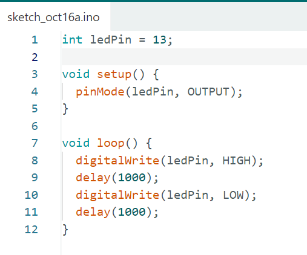
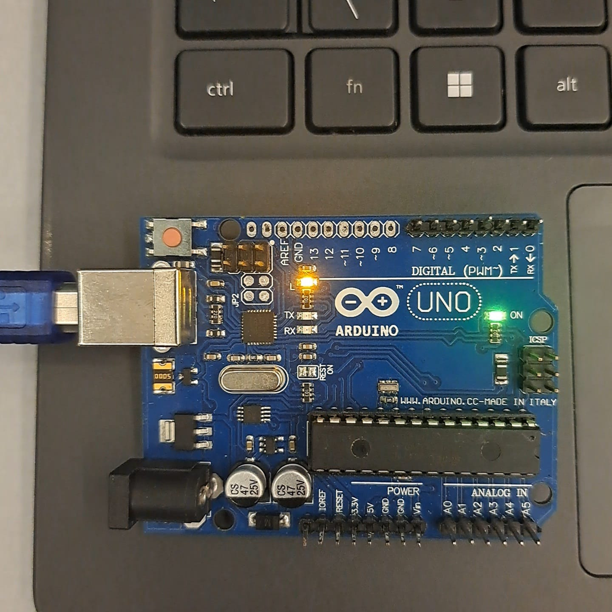
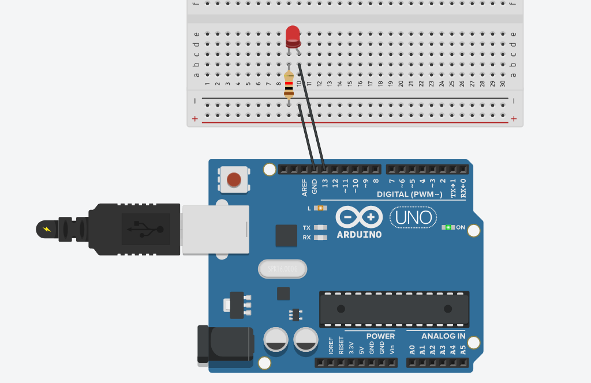
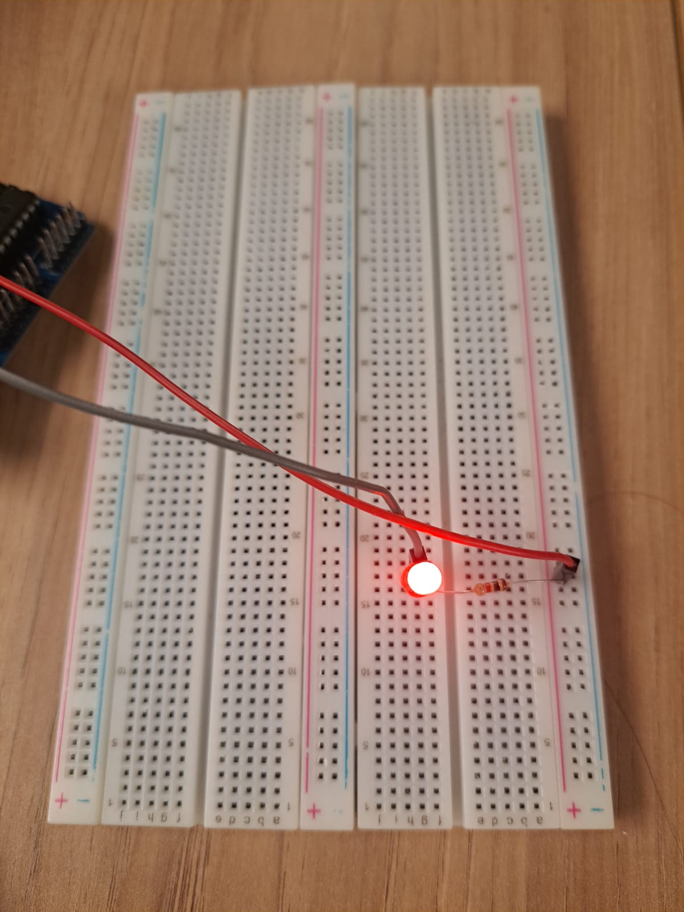

# Blink-LED

## Parte 1 - Blink LED Interno

A seguir, estão incluídos screenshots do meu  código utilizado para controlar o LED interno do Arduino. Também apresento uma fotografia do Arduino conectado ao computador com o LED aceso, comprovando o funcionamento do projeto. Por fim, disponibilizo um vídeo que evidencia o funcionamento do LED, mostrando o processo de piscar conforme programado.

[Blink LED Interno](https://youtube.com/shorts/Q8JGT0JlJWk)

---

## Parte 2 - Blink LED Externo

Nesta etapa, o foco foi controlar um LED externo conectado ao Arduino, aplicando um código idêntico ao utilizado para o LED interno. A seguir, apresento imagens do circuito montado no Tinkercad e uma fotografia do LED externo aceso, comprovando o funcionamento correto do projeto. Além disso, está disponível um vídeo demonstrando o LED externo piscando conforme o esperado.

[Link ThikerCad Projeto](https://www.tinkercad.com/things/3O2eazIrl0x-blink-externo)

[Blink LED Externo](https://youtube.com/shorts/Ro9UNPU7tAk?feature=share)

---